# <p style="text-align: center;">BSA Python Workshop</p>

<p align="center"> </p>

## Install Anaconda (or Miniconda if you're adventurous)

### Windows

If you haven't installed Anaconda, follow [this installation](https://www.datacamp.com/community/tutorials/installing-anaconda-windows) guide.
**Remember to check "Add Anaconda to `PATH`"**

#### Troubleshooting Conda Path

If you already installed Anaconda but forgot to check "*Add Anaconda to `PATH`*" box, then follow the instructions below.

1. From 'Start Menu' open Anaconda Prompt and type `conda env list`. Note the Anaconda Base Path (in this example the anaconda path is `C:\Anaconda3`)

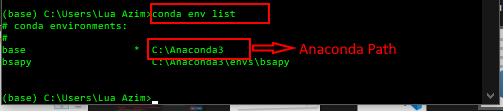

2. Goto Control Panel, and Search for System then click on "Edit System Env Variable"

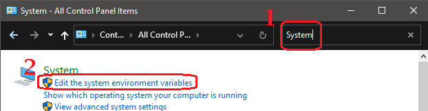

3. Click on "Environment Variable" button and add Anaconda script path to the `PATH` variable
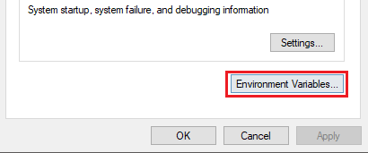
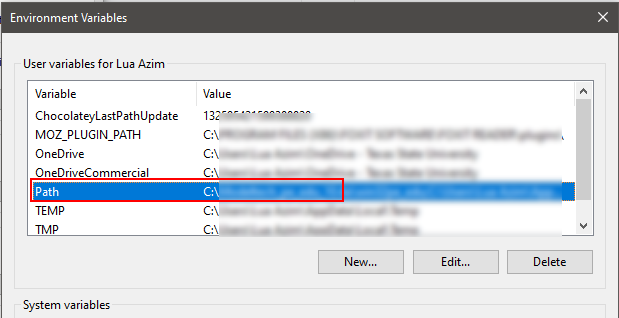

4. Then add `Scripts` to the Anaconda path from Step 1. In our case, our Anaconda Path is `C:\Anaconda3`, so we added `C:\Anaconda3\Scripts` to path

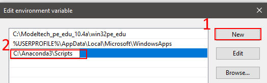

Now run a Powershell prompt using "Run As Admin" and execute the following commands:

```powershell

# Remember to run it as Admin
Set-ExecutionPolicy -ExecutionPolicy RemoteSigned -Scope CurrentUser
# Then select Yes/All

conda init powershell
conda config --set auto_activate_base True

```

### MacOSX

For MacOSX, follow [this link](https://docs.anaconda.com/anaconda/install/mac-os/) (easy installer) to install Anaconda.

If you prefer to use `brew` package manager use [this link](https://medium.com/ayuth/install-anaconda-on-macos-with-homebrew-c94437d63a37) to install Anaconda.

Open a new Terminal (Cmd+Space --> Type Terminal) and execute:

```bash

[[ -z $BASH_VERSION ]] && conda init zsh || conda init bash
conda config --set auto_activate_base True

```

#### Linux

*if you're crazy enough to use Linux you can surely install stupid Anaconda!*

### Install Visual Studio Code

Simply download the installer from this [link](https://code.visualstudio.com/download).

Install Visual Studio Code from the installer or extract from the Zip if you've chosen the portable version.

Open Visual Studio Code and install these extensions:

- [ ] Microsoft Python
- [ ] Visual Studio Intellicode
- [ ] MagicPython
- [ ] [Optional] Pylance
- [ ] [Optional] Rainbow Indent
- [ ] [Optional] Rainbow Brackets

### Setup Visual Studio Code

Open a powershell and clone this repo and open this folder in Visual Studio Code.

```powershell

git clone https://github.com/kforeverisback/bsa-ojogor.git
cd bsa-ojogor

code .

```

If `code .` command fails then start Visual Studio from Start Menu and manually open the folder from file menu

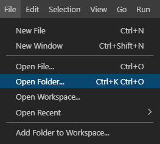

A prompt might appear about execution policy, allow it.

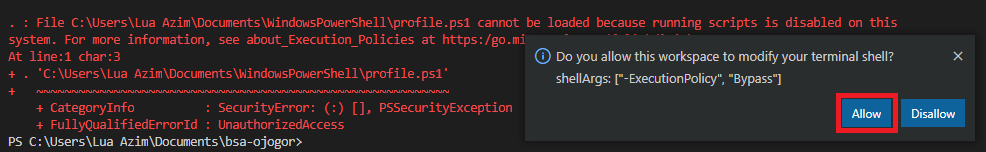

Now select Python Interpreter (Ctrl + Shift + P, type '*Interpreter*'):

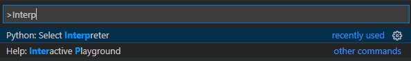

Delete the the deafult prompt:

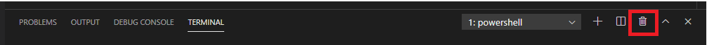

And create a new one:

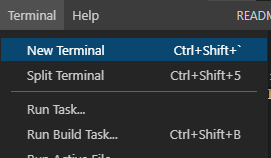

You should see a internal terminal with Conda environment enabled:

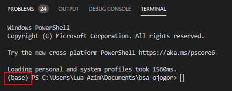
